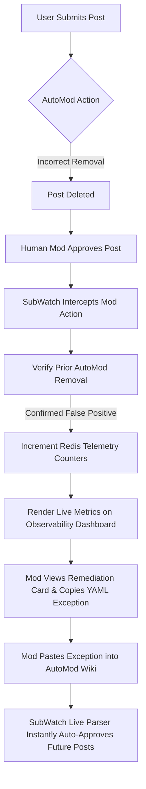

# SubWatch: The AutoModerator Observability & Auto-Remediation Platform

[](https://developers.reddit.com/)
[](https://hono.dev/)
[](https://redis.io/)
[](https://github.com/Aneesh-1302/Subwatch-hq)

**SubWatch** is an enterprise-grade observability and closed-loop automation platform built natively on the Reddit Developer Platform (Devvit). It acts as the "Datadog for Reddit Moderation," transforming community management from a blind, reactive guessing game into a precise, telemetry-driven engineering discipline by dynamically detecting AutoModerator false positives, measuring community friction, and automatically healing broken rule drift.


## The Problem: Blind Moderation

Subreddit moderation teams heavily rely on **AutoModerator** to filter spam and enforce guidelines. However, AutoModerator operates as a silent, context-unaware black box. This introduces major operational challenges:

1. **The Telemetry Void ("Blind Moderation"):** Moderators have no data on how often AutoMod gets it wrong. There are no built-in metrics for False Positive Rates (FPR), rule efficiency, or aggregate community friction.
2. **Community Attrition:** Compliant, highly active community members regularly have legitimate posts incorrectly removed.
3. **Moderator Burnout:** Mod teams waste hundreds of hours manually reviewing, approving, and correcting AutoModerator's false positives in the moderation queue.


## The Solution: Closed-Loop Telemetry & Autonomous Remediation

**SubWatch** systematically solves blind moderation using a self-healing, closed-loop telemetry pipeline:



### 1. The Autonomous Telemetry Pipeline
SubWatch intercepts moderator behaviors via the **`onModAction`** webhook trigger. When a human moderator approves a post or comment, SubWatch queries the recent mod log. If the prior remover was `AutoModerator`, SubWatch confirms a **false positive** and dynamically increments timezone-aware Redis counters, building a high-fidelity record of rule drift.

### 2. Live Self-Healing API
When a moderator updates their subreddit's AutoModerator wiki configuration, the SubWatch API instantly processes the changes. The dashboard **heals itself dynamically upon a simple browser refresh**—filtering out whitelisted flairs and promoting the next highest offender without requiring data regeneration.


## Tech Stack, Languages, & Frameworks

SubWatch is built from the ground up using modern, high-performance web and platform technologies, running fully compiled native scripts:

*   **Languages:** **TypeScript (ES6+)** for strict type safety and bulletproof data contracts across the frontend and backend, alongside semantic **HTML5** and responsive, modern **Vanilla CSS3** (utilizing HSL color variables and glassmorphic layouts).
*   **Frameworks & Platforms:**
    *   **Reddit Developer Platform (Devvit SDK v1.0.0+):** The native platform hosting our triggers, context menus, server-side APIs, and WebView sandboxes.
    *   **Hono Web Framework:** An ultra-lightweight, blisteringly fast framework used to build our backend routing architecture, securely distribute telemetry, and handle webhook endpoints.
    *   **Vite:** High-performance frontend toolchain used to compile the client-side TypeScript application and bundle optimized Web View assets.
*   **Databases & Storage:**
    *   **Native Devvit Redis:** A high-speed, concurrent, server-side Redis instance utilized for real-time counter tracking, hourly/daily telemetry distributions, and event deduplication caching.


## Key Features Shipped

### Real-Time Observability Dashboard
*   **Active Friction Index:** Calculated relative to a strict, industry-standard 5% acceptable error limit. If the False Positive Rate exceeds 5%, the system triggers a **`Critical`** rule drift status to alert moderators.
    $$\text{False Positive Rate (FPR)} = \frac{\text{False Positives}}{\text{Total AutoMod Removals}} \times 100\%$$
    $$\text{Friction Index} = \min\left(100, \text{Math.round}\left(\frac{\text{FPR}}{5\%}\right) \times 100\right)$$
*   **Rule Drift Breakdown:** Granular tracking of false-positive counts across post flairs (`News`, `Discussion`, `Meme`, `Questions`, `Meta`), highlighted by dynamic status badges (`Stable` 🟢, `Moderate` 🟡, `Critical Drift` 🔴).
*   **Timezone-Normalized Activity Heatmaps:** Tracks peak hours and days when false positives occur, helping teams optimize moderator shift coverage.

### Autonomous Auto-Remediation (Self-Healing)
*   **Dynamic Wiki Exception Parser:** Instantly reads and parses the live `config/automoderator` wiki page to identify active whitelists (e.g., `~flair_text: ["News"]`).
*   **Race-Condition Shield:** Solves Reddit desktop race conditions where flairs applied milliseconds late trigger false AutoMod removals. SubWatch waits 1.5 seconds, parses active exceptions, and **automatically restores and approves compliant posts live**!

### Secure Moderator Access Guard
*   Strict moderator-only endpoint authorization. Non-moderators who attempt to load the dashboard are instantly blocked and presented with a premium glassmorphic **"Access Restricted"** screen.


## Technical Architecture

SubWatch utilizes a zero-latency, high-availability architecture built entirely within the Reddit environment:

```text
modopsapp/
├── devvit.json               # App configuration, manifest, and Reddit permissions
├── src/
│   ├── index.ts              # Server Entrypoint (serving Hono router & Devvit triggers)
│   ├── client/
│   │   ├── index.html        # Glassmorphic telemetry dashboard layout
│   │   ├── app.ts            # Client-side metrics engine & state manager
│   │   └── styles.css        # Premium dark-mode variables and layout styling
│   └── routes/
│       ├── api.ts            # Secure moderator telemetry API endpoints
│       ├── menu.ts           # Context menu actions (Dashboard creation & Data seeding)
│       └── triggers.ts       # Real-time AutoMod mod-action event interceptors
```

*   **Native Redis Database:** Leverages Devvit's high-speed Redis client to maintain real-time keys (`friction:total`, `friction:removals`, `friction:flairs`, hourly, and daily metrics).
*   **Hono Web Server:** Runs a lightweight backend controller to secure telemetry endpoints and route events.
*   **Zero External Dependencies:** SubWatch does not make any external network requests, guaranteeing **100% data privacy**, compliance with Reddit's data policies, and sub-millisecond response times.


## Hackathon Impact & Time Savings

SubWatch directly aligns with the hackathon's core criteria:

1.  **Moderator Time Reclaimed:** By replacing manual post-approval queues with **Autonomous Auto-Remediation**, SubWatch instantly approves false positives, saving moderators hours of manual queue scrubbing every week.
2.  **Community Friction Reduced:** Standard users no longer suffer frustrating, silent post deletions. Legitimate content remains visible, sustaining high subreddit engagement.
3.  **Data-Driven Decision Making:** Outlines exactly *which* rules are drifting, giving moderators high-fidelity data to optimize their AutoMod configurations scientifically rather than guessing.


## Getting Started & Playtest Instructions

To playtest SubWatch in your private developer subreddit:

### 1. Clone & Install Dependencies
```bash
git clone https://github.com/Aneesh-1302/Subwatch-hq.git
cd Subwatch-hq/modopsapp
npm install
```

### 2. Spin up the Playtest
Launch the Devvit playtest command targeting your sandbox subreddit (e.g. `r/subwatch_hq`):
```bash
npx devvit playtest r/subwatch_hq
```

### 3. Generate the Observability Dashboard
1. Navigate to your sandbox subreddit on desktop and refresh.
2. Open the Subreddit **Mod Tools** menu (the triple-dot dropdown in your sidebar).
3. Click **Create SubWatch Dashboard**.
4. An interactive custom dashboard post containing the SubWatch telemetry application will be created instantly!

### 4. Seed Interactive Demo Data
To view the charts in a populated, high-friction state:
1. Click the mod context menu (triple-dot) on the newly created dashboard post.
2. Select **Seed Demo Data**.
3. The dashboard will instantly update with 47 false positives across 6 flair categories, showing a **Critical** drift status!

### 5. Verify the Auto-Remediation Engine Live!
1. Go to your AutoMod wiki (`config/automoderator`) and add a whitelisting remediation rule, e.g.:
   ```yaml
   ~flair_text: ["News"]
   ```
2. Post a thread with a triggering keyword and select the **News** flair.
3. AutoMod will immediately remove it. Within 1.5 seconds, SubWatch will catch the event, verify the flair against your wiki configuration, and **instantly auto-approve and restore the post live**!
4. Refresh your SubWatch dashboard—**"News" will have vanished from the active offenders list**, and your total friction index will have automatically dropped and healed!


